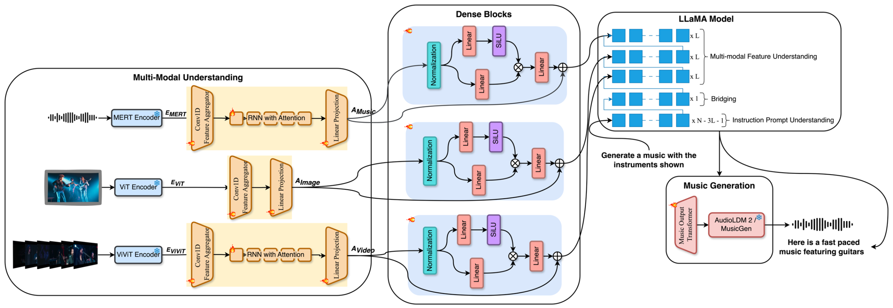

<p>
  <h1>
    
    MuMu-LLaMA: Multi-modal Music Understanding and Generation via Large Language Models
  </h1>
</p>

[](https://arxiv.org/pdf/2412.06660)
[](https://crypto-code.github.io/MuMu-LLaMA_Demo/)
[](https://huggingface.co/spaces/M2UGen/M2UGen-Demo)

This is the official repository for *[MuMu-LLaMA: Multi-modal Music Understanding and Generation via Large Language Models](https://arxiv.org/pdf/2412.06660)*.

<p align="center">
  
</p>

## 🚀 Introduction

The MuMu-LLaMA model is a Music Understanding and Generation model that is capable of Music Question Answering and also Music Generation from texts, images, videos and audios, as well as Music Editing. The model utilizes encoders such as MERT for music understanding, ViT for image understanding and ViViT for video understanding and the MusicGen/AudioLDM2 model as the music generation model (music decoder), coupled with adapters and the LLaMA 2 model to make the model possible for multiple abilities. The model architecture is given in [**_mumu_llama.py_**](./llama/mumu_llama.py).

<p align="center">
  
</p>

To train our model, we generate datasets using a music captioning and question answering model, i.e. the [MU-LLaMA](https://github.com/crypto-code/MU-LLaMA) model. The dataset generation methods are given in the [DataSet](./DataSet/) folder.

## 🤖 Model Setup

We use Python 3.9.17 for this project and the library requirements are given in requirements.txt. Create a conda environment using

```
conda create --name <env> --file requirements.txt
```

Ensure that the NVIDIA Driver is version 12 or above to be compatible with PyTorch 2.1.0.

For the working of our model, Facebook's LLaMA-2 model weights are required, details on obtaining these weights are given on [HuggingFace](https://huggingface.co/docs/transformers/main/model_doc/llama).

The trained checkpoints for our model is available here:

- [MuMu-LlaMA with MusicGen Small](https://huggingface.co/M2UGen/M2UGen-MusicGen-small)
- [MuMu-LlaMA with MusicGen Medium](https://huggingface.co/M2UGen/M2UGen-MusicGen-medium)
- [MuMu-LlaMA with AudioLDM2](https://huggingface.co/M2UGen/M2UGen-AudioLDM2)

The needed pretrained multi-modal encoder and music decoder models can be found here:

- [MERT](https://huggingface.co/m-a-p/MERT-v1-330M)
- [ViT](https://huggingface.co/google/vit-base-patch16-224-in21k)
- [ViViT](https://huggingface.co/google/vivit-b-16x2-kinetics400)
- [MusicGen](https://huggingface.co/facebook/musicgen-medium)
- [AudioLDM 2](https://huggingface.co/cvssp/audioldm2-music)

The directory of the checkpoints folder can be organized as follows:

```
.
├── ...
├── MuMu-LLaMA
│   ├── ckpts
│   │   │── LLaMA
│   │   │   │── 7B
│   │   │   │   │── checklist.chk
│   │   │   │   │── consolidated.00.pth
│   │   │   │   │── params.json
│   │   │   │── llama.sh
│   │   │   │── tokenizer.model
│   │   │   │── tokenizer_checklist.chk
│   │   │── MuMu-LLaMA-MusicGen
│   │   │   │── checkpoint.pth
│   │   │── MuMu-LLaMA-AudioLDM2
│   │   │   │── checkpoint.pth
│   │   │── knn.index
└── ...
```

Once downloaded, the Gradio demo can be run using these checkpoints.

For model with MusicGen

```
python gradio_app.py --model ./ckpts/MuMu-LLaMA-MusicGen/checkpoint.pth --llama_dir ./ckpts/LLaMA-2 --music_decoder musicgen
```

For model with AudioLDM2

```
python gradio_app.py --model ./ckpts/MuMu-LLaMA-AudioLDM2/checkpoint.pth  --llama_dir ./ckpts/LLaMA-2 --music_decoder audioldm2  --music_decoder_path cvssp/audioldm2
```

## 🧰 System Hardware requirements

For training, stage 1 and 2 use a single 32GB V100 GPU while stage 3 uses 2 32GB V100 GPUs. For inference, a single 32GB V100 GPU is used. For loading model checkpoint, approximately 49GB of CPU memory is required.

## 🫡 Acknowledgements

This code contains elements from the following repo:

- [crypto-code/MU-LLaMA](https://github.com/crypto-code/MU-LLaMA)

## ✨ Cite our work
If you find this repo useful, please consider citing: 
```bibtex
@article{liu2024mumu,
  title={MuMu-LLaMA: Multi-modal Music Understanding and Generation via Large Language Models},
  author={Liu, Shansong and Hussain, Atin Sakkeer and Wu, Qilong and Sun, Chenshuo and Shan, Ying},
  journal={arXiv preprint arXiv:2412.06660},
  year={2024}
}
```

## Star History

[](https://star-history.com/#shansongliu/MuMu-LLaMA&Date)